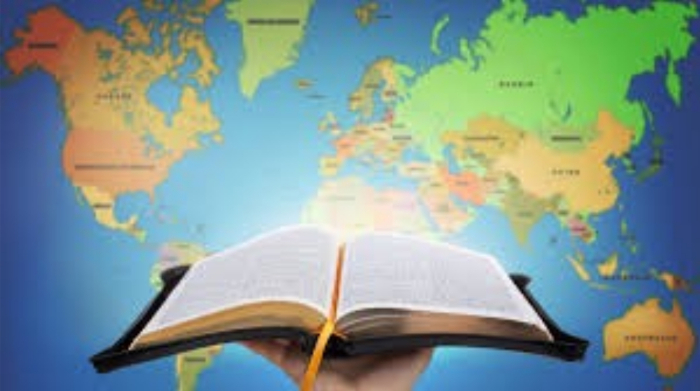

# 🧭 [Lesson 1: Introducing the Bible](../README.md)

## 🧩 The Bible is God's message to the world

🧵 THEMES

- God is greater than all and more important than all; He is the highest in authority.
- God wants us to know Him.

## 🧩 God gave His message for the whole world

---

👉 [Go ahead to page 6](./page-06.md)
