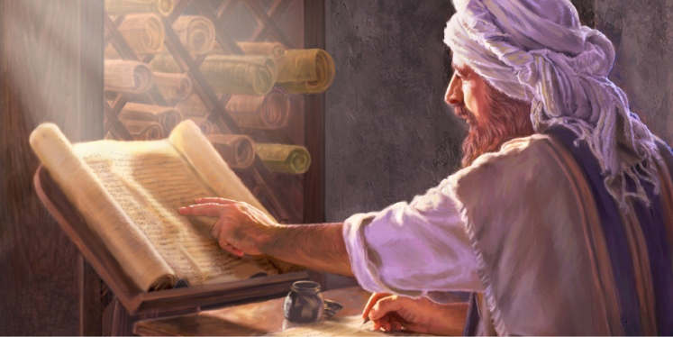

# 🧭 [Lesson 1: Introducing the Bible](../README.md)

## 🧩 New copies were made with extreme care

- The number of letters in a book were counted and the middle letter of a book was found and matched with the copy. Also the number of words were counted and the middle word was found and matched with the copy. If any mistakes were made the whole thing was destroyed and a new copy was started all over again.

- More copies were made of the Bible than any other ancient book and every single old copy that has been found has said the same thing. They match perfectly!

---

👉 [Go ahead to page 8](./page-08.md)
