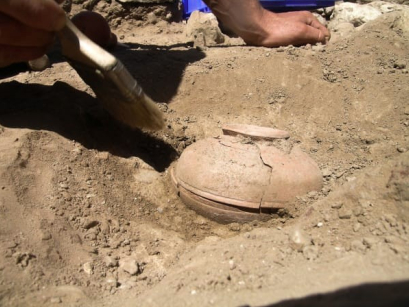
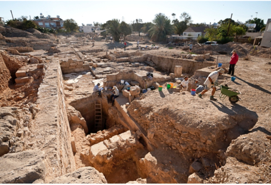

# 🧭 [Lesson 1: Introducing the Bible](../README.md)

## 🧩 The Bible is an accurate historical record

## 🧩 What does an archaeologist do?

He is a person who studies the past and digs in the ground to find things left behind by ancient civilizations long ago.

Archaeologists have dug in the areas mentioned in the Bible and have found many things that God told us about in His Word.

In fact, many of the places mentioned in the Bible can still be seen today!

The Bible is a true book that tells us our history. Archaeologists have found many pieces of ancient information that agree with what is written in the Bible, even down to the smallest details.

- exact locations of cities, towns, and buildings
- names
- dates

🧵 THEMES - God never changes

The Bible never needs to be updated or changed.

- When archaeologists and students of history make new discoveries, they find that their discoveries agree with what God has already written in the Bible.
- Books written by men, have to be updated every few years as more is learned and old ideas are replaced.

- 🔎 Example: _Did you know that they add new words to the dictionary every year? Even the dictionary has to be updated every year as new words are added._

  _But the Bible is **never** outdated. Every word of it is true!_

The Bible has not changed and never will change because God is its author.

---

👉 [Go ahead to page 10](./page-10.md)
