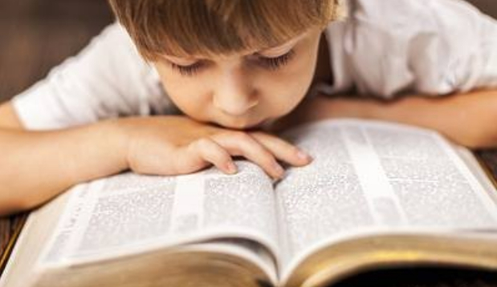

# 🧭 [Lesson 1: Introducing the Bible](../index.md)

## The Bible is the most important book in the whole world because it is the Word of God

🧵 THEMES - God is greater than all and more important than all; He is the highest in authority

🧵 THEMES - God wants us to know Him

## 📖 READ - 2 Timothy 3:16

_**All Scripture is breathed out by God** and profitable for teaching, for reproof, for correction, and for training in righteousness._

God spoke to men called prophets the exact messages He wanted written down.

- Sometimes He spoke out loud.
- Sometimes He just put the message directly to their minds.
- God caused the prophets to write exactly what He spoke to them.

---

👉 [Go ahead to page 3](./03.md)
