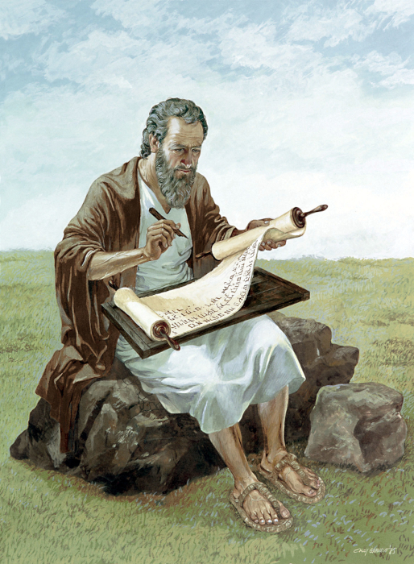

# 🧭 [Lesson 1: Introducing the Bible](../index.md)

## 🧩 The Bible is the most important book in the whole world because it is the Word of God

## 📖 READ - 2 Peter 1:20, 21

_Knowing this first of all, that no prophecy of Scripture comes from someone's own interpretation. For no prophecy was ever produced by the will of man, but men spoke from God as they were carried along by the Holy Spirit._

The Bible is not men's ideas, but God's own Word.

God gave His words to men.

---

👉 [Go ahead to page 4](./04.md)
