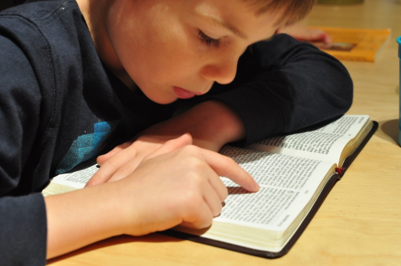

# 🧩 [Lesson 1: Introducing the Bible](../index.md)

## 🖼️ Conclusion

The Bible has been printed more times and translated into more languages than any other book in the whole world. More lives have been changed by the Bible than any other book!

The Bible is also **God's personal message to us.** He wrote it to tell everything He thought we should know.

If someone wrote you a letter, what would you do? You would read it, wouldn't you!

_Holding up your Bible..._ This Bible is God's letter to you and me. Let's study God's Word together and find out what it says!

---

❓ [Review Questions](../questions.md)
