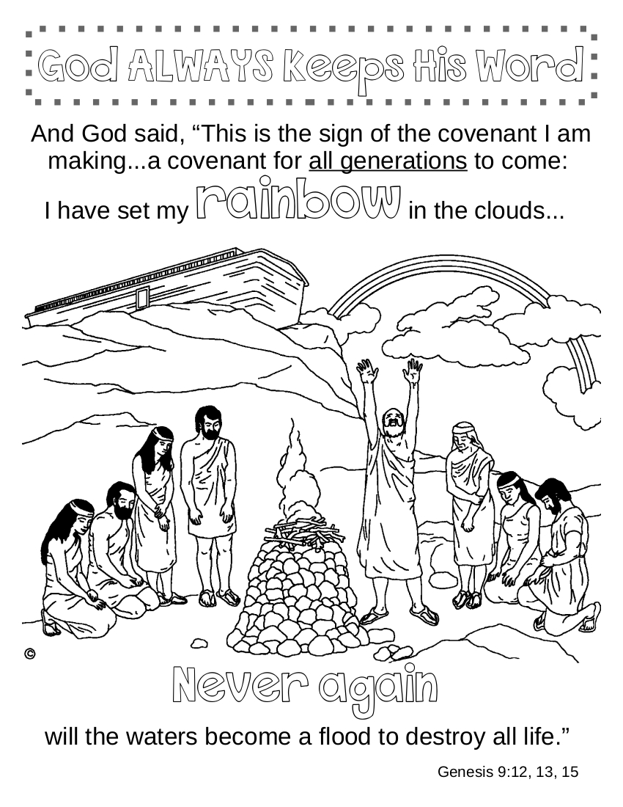

# 🧭 [Lesson 15: God Remembered Noah in the Ark and Scattered at Tower of Babel](../README.md)

## 🚀 Activities

### 🎵 Songs

- Arky, Arky
- My God is So Great
- God is So Good
- Awesome God
- Mighty is Our God
- He's Got the Whole World in His Hands

### 🖍️ Coloring Page

- #### God Keeps His Word

---

⬅️ [Go Back to 🧭 Lesson 15](../README.md)
