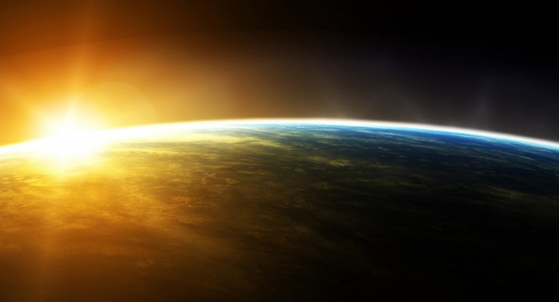

# 🧭 [Lesson 2: God Alone](../README.md)

## 🧩 Everything has a beginning (except God)

## 📖 READ – Genesis 1:1

_In the beginning, God created the heavens and the earth._

The first words God wrote for us in the Bible are, _“In the beginning...”_

- God gave us these words so that we would know there was a beginning to all things.
- Everything that we can see and everything that we can’t see had a beginning, except
  God Himself.
- Before the beginning, there was:
  - No universe
  - No earth
  - No angels
  - No plants
  - No animals
  - No people
- All these things had a beginning.

---

👉 [Go ahead to page 3](./page-03.md)
