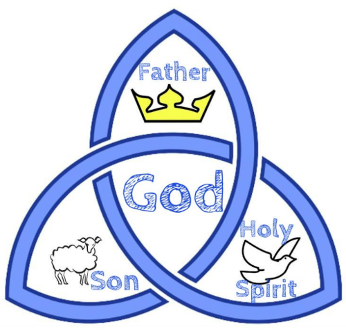

# 🧭 [Lesson 2: God Alone](../README.md)

## 🧩 God is Trinity

## 📖 READ – Genesis 1:26

_Then God said, “Let **us** make man in **our** image, after **our** likeness."_

God is forever, eternally one God.

We aren’t going to study this verse right now; we just want to look at the words _“us”_ and _“our”_.

As we study the Bible we will discover that although there is only one God, there are three persons who are equally God.

Who are these three persons?

- God the Father
- God the Son
- God the Holy Spirit

---

👉 [Go ahead to page 5](./page-05.md)
