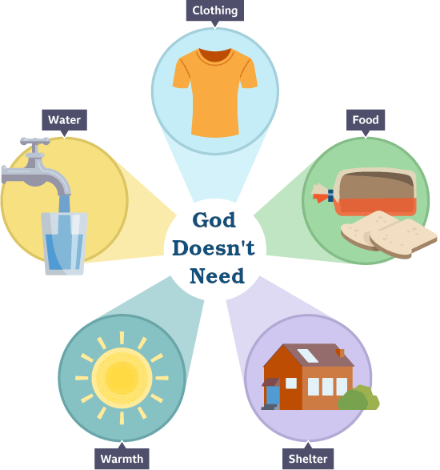

# 🧩 [Lesson 2: God Alone](../index.md)

## Because God alone existed before all things, God is completely independent of everything and everyone

🧵 THEMES - God is greater than all and more important than all; He is the highest in authority.

Because God existed before all things, we know that He didn’t need anything.

- God was there alone, before the earth, the sun, the moon, the stars, the galaxies

He does **not** need the earth or anything on it.

- He doesn’t need air to breathe.
- He doesn’t need food to eat.
- He doesn’t need water to drink.

God does not need the sun.

- He can see perfectly without any light.
- He doesn’t need to sleep; He has no need of day or night.

God doesn’t need any source of energy.

- He never gets tired, thirsty, or hungry.

God doesn't need **anything!**

| God |   |  – vs  –  man |
| :---: | :---: | :---: |
| God has no beginning and no end |   | man is born and dies |
| God is a Trinity of three persons |   | man is only one person |
| **God needs nothing** |   | **man needs food, water air, sleep, light, & protection** |

God doesn't even eed anyone to teach Him.

- He knows everything: He has all knowledge.

- He is aware of everything.

## 📖 READ – Psalm 147:5

*Great is our Lord, and abundant in power; **his understanding is beyond measure.***

***

👉 [Go ahead to page 7](./07.md)