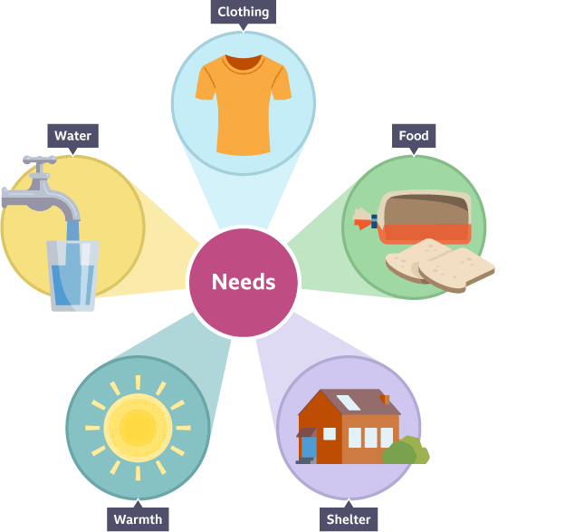

# 🧩 [Lesson 2: God Alone](../index.md)

## God doesn’t need...

What about us?

How long could we live without food and water? *Only a few days or perhaps a week without water!*

How long could we life without oxygen? *Only a few minutes.*

How long can we live without sleep? *Around 11 days.*

How long could we survive without protection against the sun’s ultraviolet rays?

🔎 Example: *Astronauts wear special suits when they leave the protection of the earth’s atmosphere. If they weren’t protected, they would die immediately from lack
of oxygen and from exposure to the sun’s ultraviolet rays.*

| God |   |  – vs  –  man |
| :---: | :---: | :---: |
| God has no beginning and no end |   | man is born and dies |
| God is a Trinity of three persons |   | man is only one person |
| **God needs nothing** |   | **man needs food, water air, sleep, light, & protection** |

God doesn’t even need anyone to teach Him.

- He knows everything; He has all knowledge

***

👉 [Go ahead to page 11](./11.md)